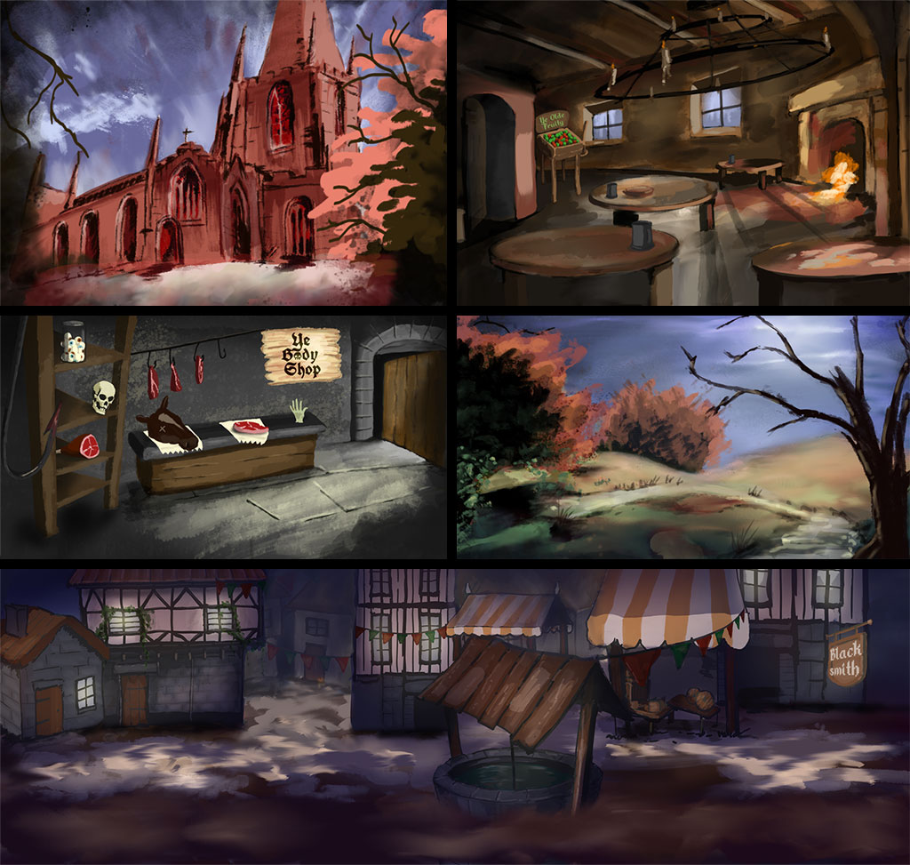
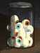

+++
date = '2026-07-03T10:00:00+01:00'
draft = false
title = 'Devlog 2 - Setting the Scene'
+++

Above is a montage of some new scenes I've been working on. ~~Not In-Game Footage~~ — unlike GTA 6, this will be very close to the actual artwork (not a realistic or valid comparison, I know).

FYI I use [Adobe Fresco](https://www.adobe.com/uk/products/fresco.html), and I highly recommend it. It's totally free and very easy to use. Randomly, I started this project with the graveyard scene. I was in Wales visiting family and started doodling in Fresco. I then realised I'd spent hours on it finger‑painting. So I bought an iPad Pro and a Pencil and started adding to it and creating more pieces.

No AI will be used in any of the process for making this game. I actually tried using AI to create art, but it was always underwhelming and lacklustre. It couldn’t even do basic sprite animation without randomly adding cruft. I want to create moody, unique artwork. And of course my style might not be to everyone’s taste, but the beauty of this project is that I don’t care. Well, okay, I care a bit — otherwise what’s the point in sharing anything?

I am, however, using AI — mainly Claude — for work on the programming side of things. It’s generally much like working with a blind junior developer, but it’s still a lot faster than working alone. For large data‑crunching tasks and figuring out bits and bobs of C#, it’s great. Having only ever spent a minimal amount of time previously using C# in a more medieval, cultish environment than this game in a previous role I’d much rather forget, this is helping a lot. Generally AI is a great tool, but if I have to correct it and look things up for it, I’m still not massively convinced it helps much more than I’ve just explained — well, for my use case at least.

I better get back to work and drawing fictitious wierd stuff in the evening. I'll leave you with a jar of eyes I keep showing people randomly and then giggling: 

Also ta-da a new commment feature: