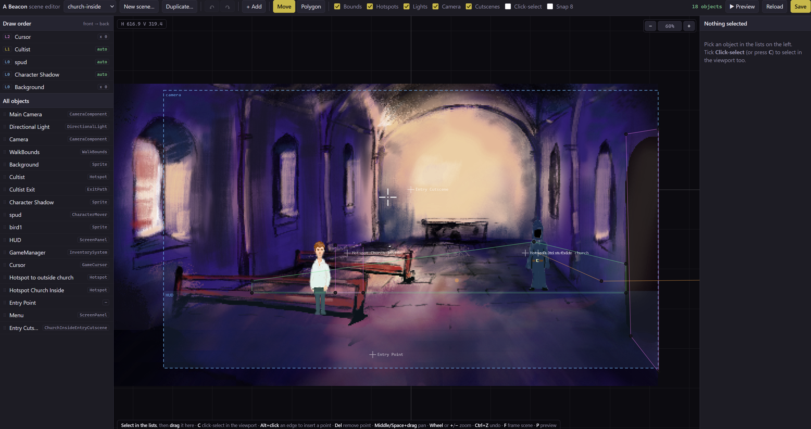
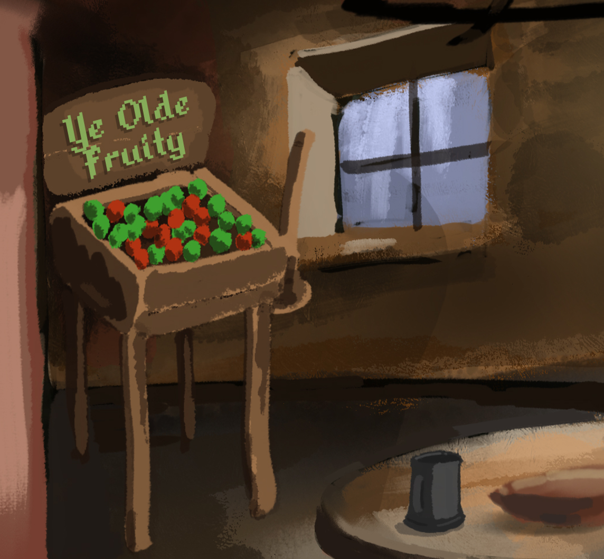

+++
date = '2026-08-05T10:00:00+01:00'
draft = false
title = 'Devlog 3 - Starting again (4th time lucky)'
+++

Where to start... Ok so I gave up on S&Box because the licensing is a nightmare. I then spent an age creating a small engine with pygame-ce. And here's the mad scientist part: an editor!

So there's that and so many crazy details I don't know where to start. I've managed to iron out a lot of problems I've had with positioning and a sorts of things I thought S&Box did an ok job of but not really. I now have full control.

Also I've created a small alpha build of the game and I'm going to invite a few people to do some testing. And who knows maybe they will...

Gambling may also be including in my next build:

Watch out betting companies!! I'm coming for ye. I mean I'm really not, this is just a point and click adventure and will not have actual gambling in it... Maybe... Hmm...

