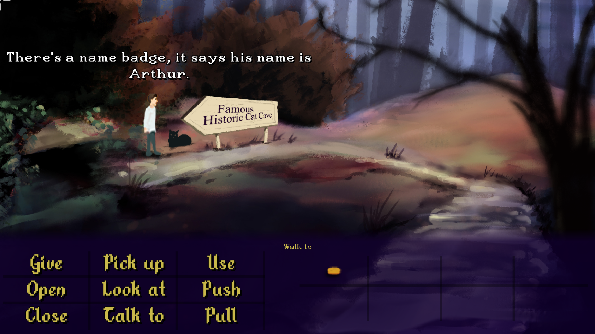

+++
date = '2026-10-03T10:00:00+01:00'
draft = false
title = 'Devlog 7 - The Cave of the Cats'
+++

Where are you going with this? Well, you might well ask. One of the many things 'A Beacon' will include is quite a lot of folklore, some of it borrowed from outside Staffordshire and relating to my Irish heritage. One such tale is the Cave of the Cats in Connaught, Ireland. It's a site with mysterious earthworks and underground passages that has only recently been surveyed with electronic scanning. Some say these caves lead to other realms.

[Further reading on the Cave of the Cats](https://www.carrowkeel.com/sites/misc/rathcroghan2.html)

So, without giving away too much, one of the quest lines will be to enter and explore the Cat Cave (as I'm calling it in-game).

